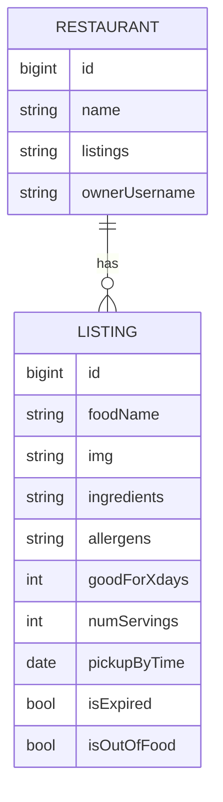

# Quotidian Backend
This is the API/backend for [Leftover](https://github.com/cinduhrz/capstone-frontend), a full CRUD app for designed to connect restaurants with surplus food to those in need. Built on a Django backend (with a PostgreSQL database) and Vue frontend, Leftover makes it easy for restaurants to list available food, while nearby groups can arrange for pickup. Users can search for local donations, making it simple to find nutritious meals that might otherwise go to waste. By reducing food waste and providing meals to those in need, Leftover is on the frontlines of fighting hunger and supporting communities. Join us today and help make a difference in the lives of people struggling with food insecurity.

#### Technologies Used
##### Backend
- Python
- Django
- PostgreSQL
- Food API (Edamam or Spoonacular probably)
- Jira

### Models

#### Backend Route Table
| Route Name |     URL    | HTTP Verb |        Description         |
|------------|------------|-----------|----------------------------|
|   Index    | /listings     |    GET    | Displays list of listings    |
|   Show     | /listings/:id |    GET    | Shows a specific listing     |
|   Create   | /listings     |    POST   | Adds new listing to database |
|   Update   | /listings/:id |    PUT    | Updates a specific listing   |
|   Delete   | /listings/:id |   DELETE  | Deletes a specific listing   |

### API
[Deployed Backend Link]()

#### User Stories
##### Provider Accounts
- AAU, I can login to and logout from my account as a providing restaurant.
- AAU, I can see a list of available foods from all restaurants.
- AAU, I can see a list of available foods from my own restaurant.
- AAU, I can see a specific food from a specific restaurant.
- AAU, I can create a new food listing.
- AAU, I can update a food listing.
- AAU, I can delete a food listing.
- AAU, I can view requests for my food listings.
- AAU, I can accept or deny these requests, and the amount will reflect on my listing.
- AAU, the listing will be deemed expired when either 1) the food has expired or 2) all the food has been given away.
- AAU, I can reopen an expired listing if someone did not come pick up their requested food.

##### Food Seeker Accounts
- AAU, I can login to and logout from my account as an organization/individual seeking food.
- AAU, I can see a list of available foods from all restaurants.
- AAU, I can see a specific food from a specific restaurant.
- AAU, I can request food from the providing restaurant.
- AAU, I can see if my request was approved or denied.